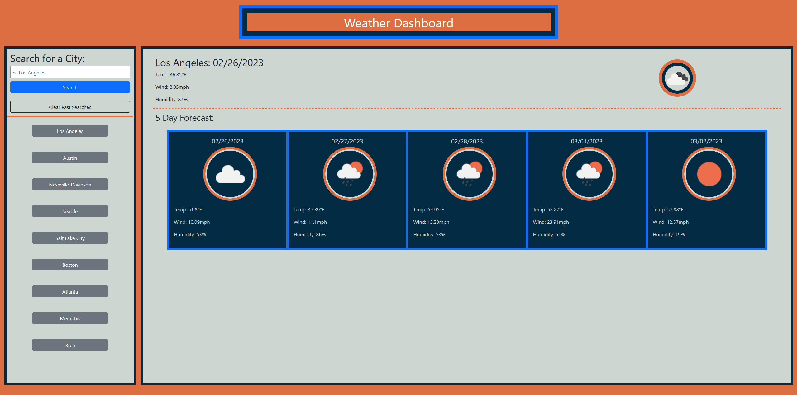

# 06 Server-Side APIs: Weather Dashboard

## Description

This website can be used as an easy way to check the current weather or the future forecast of any city. Whether you're a frequent traveller trying to plan out outfits, curious about the current weather conditions around the world, or just trying to figure out if you're going to need to take a jacket, the weather dashboard can be used as a one-stop-shop for the information you need.

Developing the Weather Dashboard has helped me grow more comfortable with things like jQuery, array manipulation in and out of localStorage, DOM Manipulation using the template literal, and API calls.

## Installation
  
N/A

## Usage
In order to use this website, open the webpage (https://tcmiller30.github.io/weather-dashboard/) in your browser. 

The user will be presented with a series of empty containers waiting for data to be inputted by the user:
- A search form asking for the user to input a city and a button to clear the Past Searches Container
- A container that gets occupied by buttons with the values of the users recent searches
- A container that will display the current date and current weather (temperature, wind speed, humidity, and weather condition) of the given city
- A container that will display a 5-day forecast for the given city in a card group

After the user searches for a city name, data supplied by the OpenWeatherMap OneCall API will populate the empty fields as shown below in the example photo. In addition to the textual information, the user will also be presented with an icon that represents the current condition of the city (e.g. sunny, thunderstorms, partial clouds, etc.)

After the user completes a search, their most recent query will be set to localStorage and appended to the top of the Past Searches container. A maximum of 9 searches will be displayed at a time. When the user has reached the maximum, they can either choose to clear the container using the button in the container above, or the least recent search will be removed from display as the most recent is appended to the top.

All of the buttons in the Past Searches container can be interacted with by the user. When one is clicked, a new API call will be made using the button's value as a parameter. The called data will then be displayed to the screen, and the clicked button will be relocated from its current location in the container to the top, as it will have become the most recent search. The order of any buttons below the relocated button's original position will be unchanged, the rest will be moved down one space.

Below is a screenshot of what the website looks like at full size.

 

## Credits

MDN Web Docs
  - https://developer.mozilla.org/en-US/docs/Web/JavaScript/Reference/Global_Objects/Array/splice
  - https://developer.mozilla.org/en-US/docs/Web/JavaScript/Reference/Global_Objects/Array/indexOf
  - https://developer.mozilla.org/en-US/docs/Web/JavaScript/Reference/Template_literals

    

## License

MIT License

Copyright (c) [2022] [Travis Miller]

Permission is hereby granted, free of charge, to any person obtaining a copy of this software and associated documentation files (the "Software"), to deal in the Software without restriction, including without limitation the rights to use, copy, modify, merge, publish, distribute, sublicense, and/or sell copies of the Software, and to permit persons to whom the Software is furnished to do so, subject to the following conditions:

The above copyright notice and this permission notice shall be included in all copies or substantial portions of the Software.
THE SOFTWARE IS PROVIDED "AS IS", WITHOUT WARRANTY OF ANY KIND, EXPRESS OR IMPLIED, INCLUDING BUT NOT LIMITED TO THE WARRANTIES OF MERCHANTABILITY, FITNESS FOR A PARTICULAR PURPOSE AND NONINFRINGEMENT. IN NO EVENT SHALL THE AUTHORS OR COPYRIGHT HOLDERS BE LIABLE FOR ANY CLAIM, DAMAGES OR OTHER LIABILITY, WHETHER IN AN ACTION OF CONTRACT, TORT OR OTHERWISE, ARISING FROM, OUT OF OR IN CONNECTION WITH THE SOFTWARE OR THE USE OR OTHER DEALINGS IN THE SOFTWARE.

